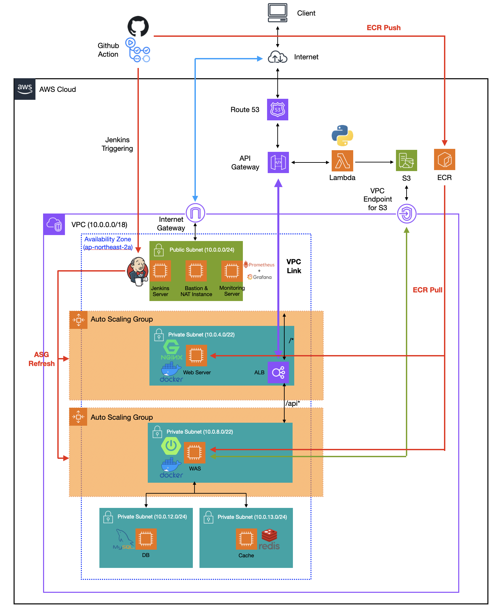
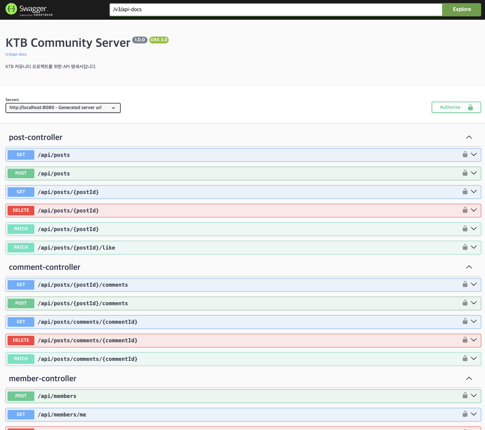
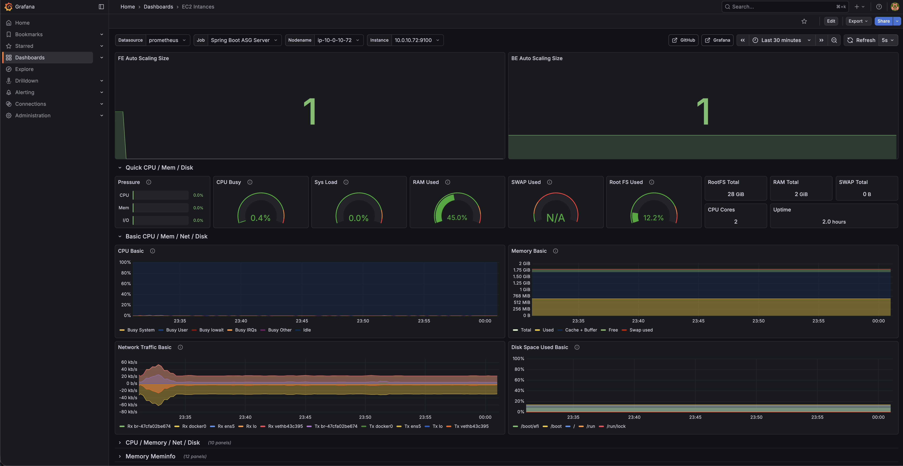
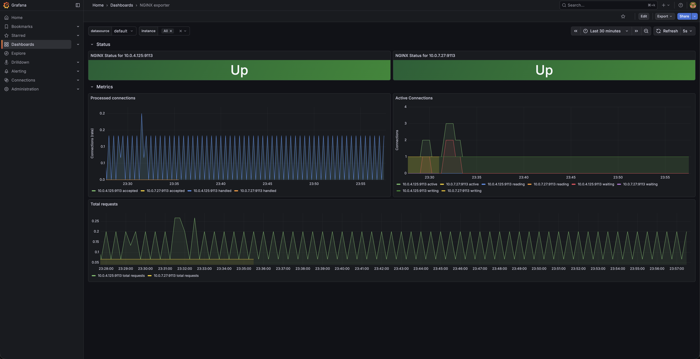
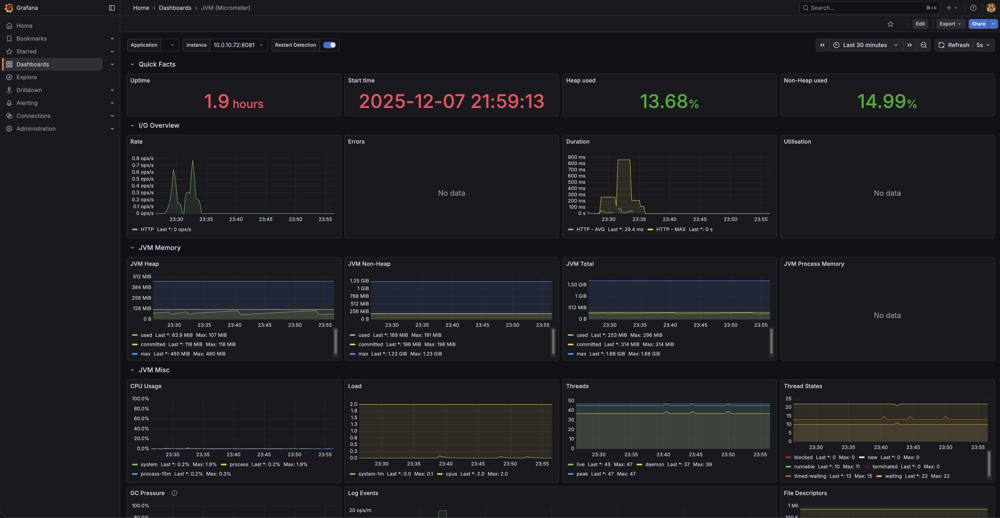
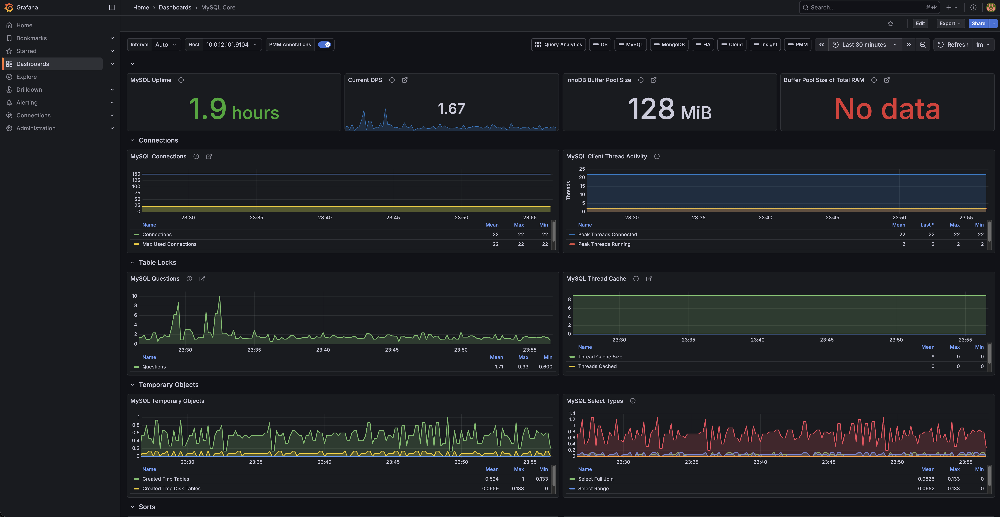
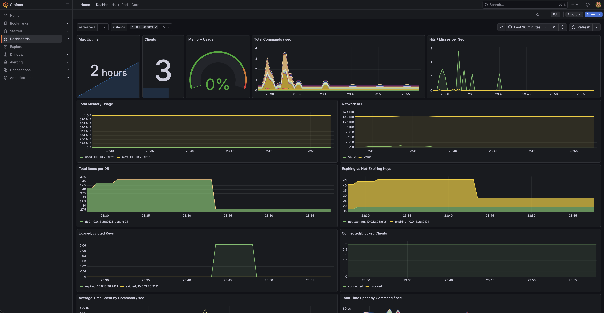

# 당신의 일상, 우리의 이야기가 될 때, 이음 🧶

### 소개
이음은 다음 철학을 가지고 만든 커뮤니티 서비스 입니다.
1. 우리의 잡답이 모여 **우리의 경쟁력**이 된다.
2. 각자의 일상이 모여 **우리의 이야기**가 된다.

이에 따라 다음과 같은 슬로건으로 준비된 간단한 커뮤니티 서비스 입니다.  
`당신의 일상 우리의 이야기가 될 때, 이음 🧶`  
본 서비스의 키워드가 "이음"인 만큼 이를 상징하는 실타래🧶를 해당 서비스의 아이콘으로 선택하여 사용하고 있습니다.

### 100만 MAU를 가정한 애플리케이션 & 인프라
이음 백엔드는 100만 MAU를 가정하고 해당 트래픽에 대응할 수 있는 인프라를 구성하였습니다.  
이를 위해 다음과 같은 내용들이 고려되었습니다.
1. 애플리케이션 로직 수준에서의 최적화 & 캐싱
2. 트래픽 증가에 대응하기 위한 인프라 구조
3. 다중 인스턴스 환경에서의 효과적 모니터링, 로그관리 시스템

### 기술스택
**언어** : Java21  
**프레임워크 & 라이브러리** : Spring Boot, JPA, Querydsl  
**테스트** : JUnit5, AssertJ  
**데이터베이스** : MySQL, Redis
**인프라** : AWS(EC2, S3, Lambda, ECR, ELB, API GW, Route53 등), Docker  
**CI/CD** : Github Action, Jenkins  
**모니터링 & 부하** : Prometheus, Grafana, Loki, K6 

### 인프라 구조도

### Swagger

### 모니터링

